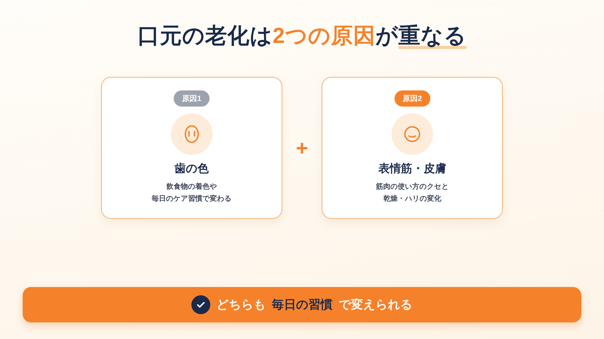
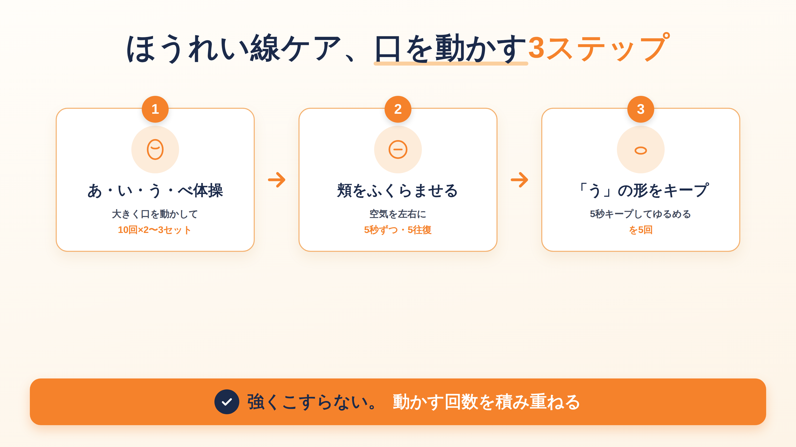

## 鏡の中の「あれ、老けたかも」に気づいた日【無料パート】

### 歯の黄ばみと、ほうれい線。同時に気になり始めていませんか

ふと鏡を見たときに、笑った顔の歯の色が思ったより黄色っぽく見えたり、頬のあたりに前より深い線が入っているのに気づいたことはありませんか。

友人との写真や、ビデオ通話の画面に映った自分の顔を見て、あれ、と思ったことがある方もいるかもしれません。人と話すとき、つい手で口元を隠すクセがついた、という声もよく聞きます。

一つひとつは小さな変化なのに、まとめて気づくと、ちょっとした焦りに変わります。エステや歯科医院に通う時間もお金も、そう簡単には確保できない、という方も多いと思います。

私は歯科衛生士として長年働くなかで、同じように感じている方に、たくさん出会ってきました。

## 口元の老化は、2つの場所で同時に起きています【無料パート】

### 「歯」の変化と「表情筋・皮膚」の変化は、原因が違います

口元の老化は、実は2つの場所で別々に起きています。

1つは歯の色です。もう1つは、頬や口まわりの筋肉、そして皮膚のハリです。

どちらも「年齢のせい」とひとくくりにされがちですが、実際は毎日の習慣の積み重ねで、ある程度自分で変えていける部分です。

**この記事で得られること**
- 自宅だけでできる、ホワイトニングケアとほうれい線対策の具体的な手順
- 続けやすくするための工夫と、セルフケアの限界の見分け方

**この記事では扱わないこと**
- 歯科医院での施術(ホワイトニング施術・美容医療)そのものの詳しい説明

## 結論:自宅のケア習慣を変えるだけで、印象は変わります【無料パート】

### なぜ、特別な施術より先に習慣なのか

結論からお伝えします。歯の黄ばみもほうれい線も、まず変えるべきは毎日のセルフケアの習慣です。

特別な道具や高い施術より先に、歯みがきの仕方、日々の口元の動かし方を整えるだけで、印象は変わっていきます。これは、歯科衛生士として現場で見てきた実感です。

## この記事で手に入る、5つの手順【無料パート】

### 何から始めれば、遠回りしなくて済むのか

ここから先で、実際にお渡しするものです。

- 今日からそのまま使える、口元セルフケアのチェックリスト
- 歯みがきの正しい型(力加減・回数の考え方)
- 自宅でのホワイトニングケアの具体的な手順と、選び方の基準
- ほうれい線を目立たせないための、口元の動かし方
- 続けるための工夫と、自宅ケアの限界を見分けるサイン

価格は980円にしました。歯科医院に一度相談に行く時間や交通費を考えると、まずは自宅でできることから試してみたい方に向けた金額です。無料パートだけでも、口元の老化が何によって起きているかは分かるので、それで十分という方はそれでも大丈夫です。

ここから先は、実際の手順を、順番にそのままお伝えしていきます。

<!-- ここから有料 -->

ここまで読んでくださって、ありがとうございます。

まず、今日からそのまま使える「口元セルフケア チェックリスト」をお渡しします。

- 歯みがきは、バス法で1日1回、じっくり丁寧に
- 唾液腺マッサージかガムで、乾燥対策をする
- ホワイトニングケアは説明書の量を守り、歯茎に薬剤が触れないよう塗る
- 「あ・い・う・べ」体操を、1日1セットから始める
- 週1回、正面から鏡で顔をチェックする
- 歯石・歯茎の腫れ・強いしみを感じたら、自宅ケアより先に歯科へ相談する

このチェックリストは、印刷して洗面所に貼っていただくのがおすすめです。ここから先の章で、それぞれの項目を1つずつ詳しくお伝えしていきます。

## 第1章 土台を整える、毎日のセルフケア習慣の見直し【有料パート】

まず最初にお伝えしたいのは、ホワイトニングもほうれい線対策も、土台になっているのは毎日の歯みがきだということです。

ここを整えないまま特別なケアだけ足しても、効果を実感しにくいですし、続きません。遠回りに見えて、実は一番の近道になる章です。

### 歯みがきの型を、力ではなく順番で見直します

まず力加減からです。力を入れすぎている方が本当に多くて、私も現場でよくお伝えしています。強くこすると、歯の表面を傷つけたり、歯茎を下げてしまう原因になります。歯ブラシは鉛筆を持つくらいの軽さで大丈夫です。

次に、みがき方の型です。歯と歯茎の境目に歯ブラシを軽く当てて、小刻みに動かす「バス法」という方法をおすすめしています。1本ずつ丁寧に、細かく揺らすようなイメージです。

ここで大事なのは回数より質です。1日3回、雑にさっと済ませるよりも、1回でいいので、じっくり長めに丁寧にやっていただくほうが、私は効果を感じやすいと思っています。朝と夜の2回で十分です。忙しい日は、夜の1回だけ丁寧にやる、でも大丈夫です。

### 乾燥対策も、あわせて習慣にします

口の中が乾いていると、汚れが落ちにくくなりますし、口元の血色も悪く見えがちです。唾液腺のマッサージ(耳の下から顎の下にかけて、指の腹で軽く押す動き)と、ガムを噛むことを、私はあわせておすすめしています。噛むときは、左右どちらかに偏らず、均等に噛んでいただくと、顎への負担も少なく続けやすいです。

### つまずきやすいのは「頑張りすぎる」ところです

まじめな方ほど、力を入れて、回数を増やして、と頑張りすぎてしまいます。ですが歯みがきは、頑張るところを間違えると逆効果になりやすいケアです。力を抜いて、回数より1回の質、というところだけ、まず覚えていただければと思います。

**今日のゴール:力を抜いたバス法で、夜1回だけでいいので丁寧にみがく。あわせて唾液腺マッサージかガムを、生活のどこかに1つ組み込む。**

## 第2章 自宅でできるホワイトニングケアの正しい手順【有料パート】

土台が整ったところで、次はホワイトニングです。この章では、自宅でのセルフケアを安全に、そして色ムラなく進める手順をお伝えします。

### なぜ、ここで一度立ち止まってほしいか

ホワイトニングは、正しい手順で行えば自宅でも変化を感じやすいケアです。ただ、間違った使い方をすると、色ムラになったり、歯や歯茎に負担をかけてしまうことがあります。ここは私自身、現場で痛い思いをした経験があるので、先にお伝えしておきたい章です。

### 手順:市販のホワイトニングケアを使うときの流れ

1. 使う前に、歯の表面の汚れを軽く歯みがきで落とします(ゴシゴシしなくて大丈夫です)
2. 説明書に書かれた分量・時間を守ります。「多めに塗れば早く白くなる」は誤りで、むしろ知覚過敏の原因になりやすいです
3. 使用後は、口の中をしっかりゆすいで、薬剤を残さないようにします
4. 色の変化は数日〜数週間かけて少しずつ出てくることが多いので、毎日の写真やメモで変化を記録すると続けやすいです

色ムラになりやすいのは、歯の一部分だけに集中して塗ってしまったり、逆にムラなくと思って厚塗りしてしまうケースです。薄く均一に、が基本になります。

### 市販品を選ぶときに、私が見ている場所

研磨剤の粒子が粗いものは、白さを感じやすい反面、歯の表面を傷つけやすいので、普段使いには避けています。フッ素が配合されているかどうかも、私はあわせて見るようにしています。また、ホワイトニングケアをしている期間中は、コーヒーや赤ワイン、カレーなど色の濃い飲みものや食べものは、色が入りやすくなっています。この期間だけは控えてください。どうしても摂る場合は、そのあとすぐに口をゆすいでください。

### つまずく場所:歯茎に薬剤が触れてしまう事故

私自身、施術の場で保護剤の量が足りず、薬剤が歯茎に触れて白くなってしまった経験があります。自宅でのセルフケアでも、同じことは起こり得ます。歯や器具の使い方に慣れないうちは、歯茎まわりに薬剤がつかないよう、少し余裕を持った量とペースで進めていただくことをおすすめします。もし歯茎に触れて白くなったり、しみるような感覚があれば、その日は使用を中止して、水でよくゆすいでください。

### どのくらいで効果を感じますか

個人差が大きいので断定はできませんが、私が見てきた範囲では、2〜4週間ほど続けると変化に気づき始める方が多い印象です。もともと知覚過敏がある方は、使用頻度を控えめにするか、低刺激タイプのものから試していただくのが安心です。心配な場合は、使う前に歯科医院で相談していただくのが一番確実です。

**今日のゴール:今使っているケア用品の説明書を、量と時間だけもう一度確認する。歯茎に薬剤がつかない塗り方を意識する。**

## 第3章 ほうれい線を目立たせない口元ケアの手順【有料パート】

ホワイトニングと並んで気になるのが、ほうれい線だと思います。ここでは、表情筋を無理なく動かす手順をお伝えします。

### なぜ、口元だけを気にしても変わりにくいのか

ほうれい線は、頬や口まわりの筋肉(表情筋)の使い方のクセと、乾燥や皮膚のハリの変化が重なって目立ってきます。マッサージだけを強くやっても、筋肉の使い方が変わらなければ、感じ方は変わりにくいです。

### 手順:無理なく続けられる口元の動かし方

1. 口を大きく「あ・い・う・べ」と動かす体操を、1セット10回、1日2〜3セット行います。テレビを見ながらでも大丈夫です
2. 頬を空気でふくらませて、左右に5秒ずつ移動させる動きを5往復します
3. 唇をすぼめて「う」の形を作り、5秒キープしてゆるめる、を5回繰り返します

強くこすったり、指で押し込むように動かす必要はありません。あくまで筋肉を「使う」ことが目的です。

### やらないほうがいいこと

早く変化を感じたくて、指でゴシゴシ押したり、強くつまんだりする方がいますが、これは肌への負担になりやすく、私はおすすめしていません。また、痛みを感じるほど大きく口を開け続けるのも、顎への負担になるので避けてください。表情筋の体操は、力を入れる場所ではなく、動かす回数を積み重ねる種類のケアです。

### 毎日やらないとダメですか

毎日でなくても、続けやすいペースで大丈夫です。3日坊主になるくらいなら、週4〜5日を目標にするほうが、結果的に長く続きます。

**今日のゴール:「あ・い・う・べ」体操を、今日1セットだけやってみる。**

## 第4章 続けるための工夫、挫折しない仕組み化【有料パート】

ここまでの手順は、どれも特別に難しいものではありません。ただ、続けることが一番難しい、というのが正直なところだと思います。

### なぜ、多くの方が3日で終わってしまうのか

理由はシンプルで、変化がすぐに見えないからです。ホワイトニングもほうれい線対策も、効果を感じるまでに数日から数週間かかります。その間に「意味があるのかな」と感じて、やめてしまう方が多いです。

### 手順:続けている方がやっている工夫

1. カレンダーやスマホのメモに、やった日だけ印をつける(やらなかった日は気にしない)
2. 歯みがきや洗顔など、すでにある習慣の直後にセットで行う(「歯をみがいたら、あ・い・う・べ体操」のように)
3. 週に1回、鏡で正面から自分の顔を撮っておく(毎日だと変化が分かりにくいですが、1週間単位だと気づきやすいです)

### つまずく場所:完璧を目指してしまう

まじめな方ほど、毎日全部やらないと意味がない、と思ってしまいがちです。ですが、続けている方の多くは「できなかった日があっても気にしない」というスタンスです。全部やらなくて大丈夫です。まずは1つだけ続けてみてください。

**今日のゴール:続けたいケアを1つだけ選んで、記録する場所(カレンダーやメモ)を決める。**

## 第5章 セルフケアで難しいと感じたときの選択肢【有料パート】

最後に、自宅ケアだけで様子を見ていい場合と、歯科医院に相談したほうがいい場合の見分け方をお伝えします。

### なぜ、この線引きが大事なのか

自宅ケアは、あくまで日々のメンテナンスです。すでに何か症状が出ている場合は、セルフケアで様子を見るよりも、早めに相談したほうが、結果的に負担が少なく済みます。

### 手順:相談の目安になるサイン

- 歯石が目立つ、または歯の表面がざらつく感じがある
- 歯茎が腫れている、みがくと血が出る
- 知覚過敏の症状が強く、しみて集中してケアができない
- ホワイトニングケアを数週間続けても、色の変化をまったく感じない

これらに当てはまる場合は、セルフケアを続ける前に、一度歯科医院で見てもらうことをおすすめします。

### 相談のときに聞かれることが多い質問

「今使っているケア用品を続けていいか」「歯石や着色の程度」「知覚過敏の原因」などを聞かれることが多いです。今使っている市販品があれば、パッケージや成分表を持っていくとスムーズです。

### つまずく場所:「これくらいで相談していいのか」と迷ってしまう

迷っている段階で、すでに相談していいタイミングです。歯科衛生士としては、様子を見すぎて悪化してから来られるより、早めに声をかけていただくほうが、対応の選択肢が多く残っています。

**今日のゴール:自分の歯茎や歯の状態を鏡でチェックして、上のサインに当てはまるものがないか確認する。**

**今日やること**

チェックリストの中から、今日1つだけ選んで、まずそれだけやってみてください。全部を一度に変えようとしなくて大丈夫です。

最後まで読んでくださって、ありがとうございました。
